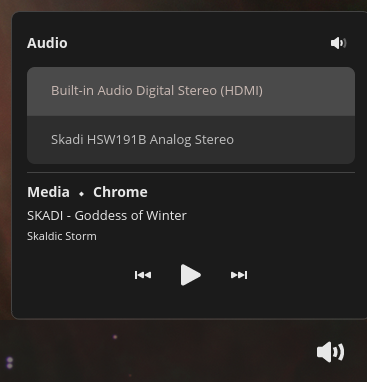

# Skadi Applet

Audio and media control applet for the [COSMIC](https://system76.com/cosmic) desktop.



## Features

### Audio

- Toggle mute/unmute on the default audio output
- List all available output devices and switch the default sink with a single click
- Active device is highlighted in the list

### Media

- Shows the active MPRIS media player name alongside the section header (e.g. **Media ⬩ Chrome**)
- Displays the current track title and artist when available
- Play/Pause, Previous, and Next track controls — Previous/Next are only active when the player reports it supports them (e.g. radio streams disable navigation)

## Installing

### From source

You will need [just](https://github.com/casey/just) and the standard Rust toolchain ([rustup](https://rustup.rs/)), plus a few system libraries. On a Debian/Ubuntu-based system:

```sh
sudo apt install just libxkbcommon-dev
```

Clone the repo and install:

```sh
git clone https://github.com/akuzko/skadi-applet
cd skadi-applet
just build-release
just install
```

To install without root (e.g. into `~/.local`):

```sh
just install rootdir=$HOME/.local prefix=''
```

This installs the binary to `~/.local/bin/skadi-applet` and the `.desktop` entry to `~/.local/share/applications/`.

### Post-installation

Once installed, the applet should appear in COSMIC Settings when editing applets on the panel or dock. It can also be launched directly from a terminal for testing:

```sh
skadi-applet
```

Logs can be viewed with:

```sh
journalctl SYSLOG_IDENTIFIER=skadi-applet
```

## Building

```sh
# Debug build
just build

# Release build
just build-release

# Run directly (without installing)
just run
```

## Packaging

To package for a Linux distribution, vendor dependencies first, then build from the vendored sources:

```sh
just vendor
just build-vendored
just rootdir=debian/skadi-applet prefix=/usr install
```

## Developers

Developers should install [rustup](https://rustup.rs/) and configure their editor to use [rust-analyzer](https://rust-analyzer.github.io/).

A [justfile](./justfile) is included for the [casey/just](https://github.com/casey/just) command runner:

- `just` — release build (default)
- `just run` — build and run
- `just check` — run clippy
- `just install` — install into the system
- `just vendor` — create a vendored dependency tarball
- `just build-vendored` — compile using vendored dependencies

## Translators

[Fluent](https://projectfluent.org/) is used for localization. Translation files are in the [i18n directory](./i18n). To add a new translation, copy the [English (en)](./i18n/en) directory, rename it to the desired [ISO 639-1 language code](https://en.wikipedia.org/wiki/List_of_ISO_639-1_codes), and provide translations for each message identifier. Messages that don't need translation can be omitted.
